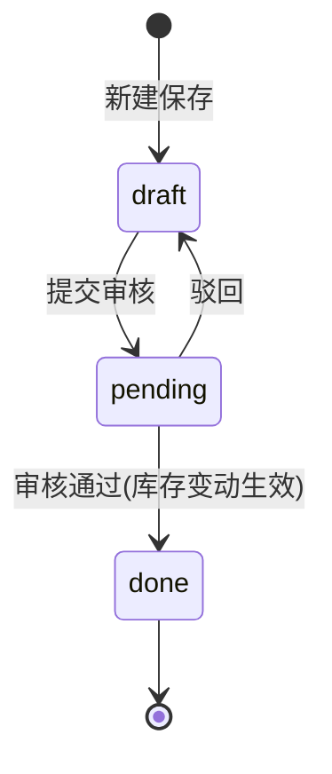

# 云仓储 WMS · 出入库管理后台 — 交互需求文档（PRD）

> 文档版本：v1.0
> 整理日期：2026-07-27
> 适用范围：当前线上已交付的全部功能（生产环境 https://wms-app-285760-10-1456992047.sh.run.tcloudbase.com）
> 说明：本文档基于已上线代码逆向梳理，作为界面与交互的基线说明，供后续迭代、设计评审与回归测试对照使用。

---

## 1. 产品概述

**云仓储 WMS** 是一套面向中小仓储场景的「原料 / 成品出入库管理后台」，覆盖基础档案、出入库单据、实时库存、库存流水与发票（进项/销项 + 报销单）管理。

| 项 | 说明 |
|---|---|
| 定位 | 单仓库、轻量化 WMS，区分原料（按批次）与成品（按物料）两套库存逻辑 |
| 技术栈 | Node.js + Express + MySQL；前端为原生 JS + TDesign 风格浅色 UI |
| 登录账号 | `admin` / `inout` / `packer` / `finance`，密码 `Wms@2026` |
| 角色数 | 4（admin / inout / packer / finance） |
| 部署 | 腾讯云 CloudBase CloudRun（容器型） |

---

## 2. 角色与权限矩阵

系统采用 JWT 鉴权，Token 有效期 8 小时。菜单按角色可见性过滤；操作按钮按角色显隐；写操作后端二次校验角色。

| 能力 | admin | inout（出入库管理员） | finance（财务） | packer（打包/出货） |
|---|---|---|---|---|
| 查看全部页面 | ✅ | ✅ | ✅ | ✅ |
| 基础档案（大类/物料/供应商/客户）新增·删除 | ✅ | ✅ | ❌ | ❌ |
| 新建入库/出库单（草稿） | ✅ | ✅ | ❌ | ❌ |
| 提交审核 | ✅ | ✅ | ❌ | ❌ |
| 审核通过/驳回（触发库存变动） | ✅ | ❌ | ✅ | ❌ |
| 发票上传 / 单张入账 / 报销单批量入账 | ✅ | ✅ | ✅ | ❌（前端可点击，后端 403） |
| 删除发票 | ✅ | ❌ | ✅ | ❌ |

> ⚠️ 已知差异：`packer` 角色目前无专属写操作（原「打包确认」功能已下线），实际为只读视角。发票「上传」按钮前端未做角色限制，packer 点击会触发后端 403 提示，建议后续统一前端显隐。

---

## 3. 全局框架与通用交互规范

### 3.1 布局
- 顶部条：产品名「云仓储 WMS」+ 环境标识 `env: w2026` + 当前用户 + 退出按钮。
- 左侧栏：按分组展示菜单（总览 / 基础数据 / 入库 / 出库 / 库存 / 财务）。
- 右侧内容区：面包屑 + 页面标题 + 视图区。

### 3.2 通用交互组件
- **弹窗（Modal）**：点击遮罩空白处或「取消」关闭；错误提示以红色条幅出现在弹窗顶部。
- **表格**：列表类页面统一卡片式表格；空数据展示占位文案与引导按钮。
- **状态标签（tag）**：
  - 单据状态：`draft` 草稿（灰）/ `pending` 待审核（橙）/ `done` 已审核（绿）/ `cancel` 已作废。
  - 发票置信度：`✓ 高置信`（绿）/ `! 待确认`（橙）/ `⚠ 未匹配`（红）/ `📋 报销单`（蓝）。
- **确认操作**：删除类操作均弹 `confirm` 二次确认（供应商/客户/发票/类别）。
- **分页**：发票列表分页（默认每页 20 条），含上一页/下一页。

---

## 4. 功能模块详解

### 4.1 概览（Dashboard）
- **入口**：侧栏「总览」。
- **内容**：
  - KPI 卡片：在库物料种类数、待财务审核单据数、低于安全库存物料数、近期流水笔数。
  - 审批链说明：「出入库管理员制单 → 提交 → 财务审核（库存变动生效）」。
- **交互**：纯展示，无写操作。

### 4.2 原料大类 / 成品物料（基础数据）
- **入口**：侧栏「基础数据 → 原料大类」，页内 Tab 切换「原料大类 / 成品物料」。
- **原料大类（raw_category）**
  - 列表字段：编号、大类名称、规格、操作（删除）。
  - 新增：弹窗填「大类名称 + 规格」，编号保存后自动生成（RC0001 起）。
  - 删除：二次确认后软删（`status=0`）。
- **成品物料（material）**
  - 列表字段：编码、名称、规格、类型（原料/成品）、单位、安全库存、参考价。
  - 新增弹窗：编码、名称、规格、类型（成品/原料）、单位、安全库存、参考价。
- **权限**：仅 `admin` / `inout` 可见「新增/删除」按钮。

### 4.3 供应商 / 客户（往来单位）
- **入口**：侧栏「基础数据 → 供应商 / 客户」。
- **布局**：同页上下两个卡片——供应商表、客户表。
- **列表字段（两者同构）**：编码、名称、联系人、电话、操作（删除）。
- **新增**：弹窗填编码、名称、联系人、电话、地址；分别 POST 到 `/partners/suppliers` 或 `/partners/customers`。
- **删除**：二次确认后软删（`status=0`），已关联单据保留、仅列表隐藏。
- **权限**：仅 `admin` / `inout` 可见按钮。

### 4.4 入库

#### 4.4.1 原料入库（purchase）
- **入口**：侧栏「入库 → 原料入库」→「+ 新建原料入库单」。
- **单据头**：往来单位（供应商下拉）、备注。
- **明细行（按大类 + 自定义原料）**：
  - 选择「原料大类」+ 填「原料名称（自定义）」+ 系统提示「编号自动生成」+ 生产日期 + 有效期 + 单位 + 数量 + 单价。
- **保存**：POST `/inbound`，生成草稿单，单据号自动生成（IN 前缀）。

#### 4.4.2 成品入库（finish）
- **入口**：侧栏「入库 → 成品入库」。
- **明细行**：选择「成品物料」（带编码/名称）+ 数量 + 单价（默认带出参考价）。
- **保存**：同上。

#### 4.4.3 入库单列表与操作（通用）
- **列表字段**：单据号、类型、往来单位、数量、金额、状态、物料明细（聚合「名称×数量/单位」）、操作。
- **操作按钮（按状态/角色）**：
  - 「明细」：弹窗展示每行 编码/名称/单位/数量/单价/金额/生产日期/有效期。
  - 「提交审核」：仅 `draft` 且 `admin`/`inout` 可见。
  - 「审核通过 / 驳回」：仅 `pending` 且 `admin`/`finance` 可见；审核通过触发库存增加（成品入 `stock`、原料生成 `raw_stock_batch` 批次）。

### 4.5 出库

#### 4.5.1 原料出库（pick）
- **入口**：侧栏「出库 → 原料出库」→「+ 新建原料出库单」。
- **明细行（选已入库批次）**：
  - 下拉选择「原料批次」，选项文案含「名称（大类｜库存 数量 单位）」。
  - 填出库数量、单价。
  - 限制：只能选有库存的批次（来自 `GET /stock/batches`）。
- **保存**：POST `/outbound`，审核通过后扣减对应批次库存（`raw_stock_batch.qty`）。

#### 4.5.2 成品出库（sale）
- **入口**：侧栏「出库 → 成品出库」。
- **明细行**：选择「成品物料」，下拉选项含「编码 名称（库存 数量 单位）」实时可用库存提示；填数量、单价。
- **保存**：同上；审核通过后扣减对应成品库存（`stock.qty`）。

#### 4.5.3 出库单列表与操作
- 与入库列表同构（字段、明细、提交/审核按钮一致）。
- 审核通过触发库存扣减；库存不足时后端返回错误并阻断。

### 4.6 实时库存
- **入口**：侧栏「库存 → 实时库存」。
- **分区一 · 原料库存（按批次）**
  - 字段：编号、名称、大类、单位、数量、金额、效期（生产/有效）。
  - 数据来自 `raw_stock_batch`。
- **分区二 · 成品库存**
  - 字段：编码、名称、规格、类型、单位、数量、金额、安全库存、预警（低于安全库存标红）。
  - 数据来自 `stock`（`kind != raw`）。
- **交互**：纯展示，含低库存预警高亮。

### 4.7 库存流水
- **入口**：侧栏「库存 → 库存流水」。
- **列表字段**：时间、单据号、类型（入库/出库）、物料、变动数量（增绿/减红）、结存数量、操作人。
- **数据**：成品流水（`stock_flow`）+ 原料批次流水（`raw_stock_flow`）合并按时间倒序。
- **交互**：纯展示。

### 4.8 发票管理
- **入口**：侧栏「财务 → 发票管理」。

#### 4.8.1 列表与统计
- **统计卡片**：进项发票数、销项发票数、价税合计、可抵扣进项税。
- **筛选栏**：类型（进项/销项）、种类（专票/普票/数电专/数电普）、月份、关键字（发票号/开票单位/往来单位）、搜索、清除筛选、「+ 上传发票」。
- **列表字段**：发票号、类型、开票单位、种类、开票日期、金额(不含税)、税额、价税合计、费用类别、往来单位、状态、操作（查看/删除）。
- **分页**：20 条/页。

#### 4.8.2 上传与解析（核心能力）
- 点击「+ 上传发票」弹窗：支持点击选择或拖拽 PDF。
- 支持类型：增值税电子发票 / 数电票 / 专票 / 普票 / **报销单汇总 PDF**（自动识别明细批量入账）。
- 解析后置入「上传结果」视图：

**A. 单张发票（非报销单）**
- 左：PDF 预览占位 + 文件名；右：字段表单（带置信度着色）。
- **开票单位智能匹配**：
  - 精确匹配 → 显示「✓ 精确匹配」+ 税号 + 关联往来单位。
  - 模糊匹配 → 下拉候选 + 匹配度%，可选「+ 新建往来单位…」。
  - 未匹配 → 提供「+ 用此名称新建」「手动搜索已有」。
- 可编辑字段：发票号、开票日期、发票类型（进项/销项）、发票种类、往来单位、费用类型、金额(不含税)、税额、价税合计。
- 顶部提示「N 项待确认」或「✓ 全部字段已识别，可直接入账」。
- 操作：「确认入账」（POST `/invoices`）。

**B. 报销单（批量）**
- 顶部提示：识别成功条数 + 合计金额；说明「报销单不含开票单位/税额/种类，可手动补充」。
- 表格行：序号、费用类型（下拉，默认 PDF 原始值：物流/餐饮/商品/服务等）、开票日期、金额、票据号码、开票单位（选填）。
- 操作：「批量入账（N 条）」按钮——**点击后置灰 + loading「入账中…」防重复**；按发票号去重（已存在则跳过），返回「已入账 X 条（跳过 Y 条重复）」；原始凭证 PDF 仅附在首条记录。

#### 4.8.3 详情
- 弹窗展示：发票原件（有原件可「下载原件 PDF」）、开票单位/税号、类型、种类、往来单位、费用类型、金额/税额/价税合计、开票日期、上传人。
- 报销单来源采用统一高置信样式渲染（不依赖 confidence 子对象）。
- 操作：删除（二次确认）、关闭。

---

## 5. 核心业务规则

### 5.1 单据状态机

### 5.2 审批链
1. `admin` / `inout` 制单并保存为草稿（draft）。
2. 同一角色提交 → 状态 `pending`。
3. `admin` / `finance` 审核通过 → 状态 `done`，**库存在此刻变动**（入库增、出库减）；驳回回 `draft`。

### 5.3 库存扣减规则
- **成品入库**：`stock.qty += 入库量`，金额同步累加；流水入 `stock_flow`。
- **原料入库**：按「大类 + 名称 + 生产/有效期」生成/累加 `raw_stock_batch` 批次；流水入 `raw_stock_flow`。
- **成品出库**：按 `material_id` 扣减 `stock.qty`，库存不足报错阻断；流水入 `stock_flow`。
- **原料出库**：按所选 `batch_id` 扣减 `raw_stock_batch.qty`；流水入 `raw_stock_flow`。
- 库存变动均在事务 + 行锁内完成，保证一致性。

### 5.4 发票置信度判定
- `high`：开票单位精确匹配往来单位。
- `medium`：模糊匹配或个别字段中等置信。
- `low`：未匹配往来单位。
- `reimbursement`：报销单批量导入。

---

## 6. 数据模型（核心表）

| 表 | 说明 | 关键字段 |
|---|---|---|
| `wms_user` | 系统用户 | username, password(bcrypt), role, status |
| `material` | 物料/产品档案 | code, name, spec, type(raw/finished), unit, safety_stock, ref_price |
| `supplier` / `customer` | 供应商 / 客户 | code, name, contact, phone, address, status |
| `raw_category` | 原料大类 | code(自动 RC0001), name, spec |
| `inbound_order` / `outbound_order` | 出入库单头 | order_no, type, supplier_id/customer_id, total_qty, total_amount, status |
| `inbound_item` / `outbound_item` | 出入库明细 | material_id / category_id / batch_id, material_name, qty, unit_price, amount |
| `stock` | 成品实时库存 | material_id, qty, amount |
| `raw_stock_batch` | 原料批次库存 | category_id, material_name, material_code, production_date, expiry_date, qty, amount |
| `stock_flow` / `raw_stock_flow` | 库存变动流水 | order_no, biz_type, change_qty, balance_qty, operator_name |
| `invoice` | 发票/报销单 | invoice_no, invoice_type, billing_name, expense_type, amount_*, confidence_level, file_data |

> 软删除统一用 `status=0`（supplier/customer/category）；发票为硬删除（DELETE）。

---

## 7. 接口清单（按模块）

**认证**
- `POST /api/login` 登录
- `GET /api/me` 当前用户

**基础档案**
- `GET/POST /api/categories` 原料大类列表/新增
- `PUT/DELETE /api/categories/:id` 编辑/删除
- `GET/POST /api/materials` 物料列表/新增
- `GET /api/partners/suppliers` `GET /api/partners/customers` 列表
- `POST /api/partners/suppliers` `POST /api/partners/customers` 新增
- `DELETE /api/partners/suppliers/:id` `DELETE /api/partners/customers/:id` 软删

**出入库**
- `GET /api/inbound` `GET /api/outbound` 列表（含物料明细聚合 `items_summary`）
- `GET /api/inbound/:id/items` `GET /api/outbound/:id/items` 明细
- `POST /api/inbound` `POST /api/outbound` 新建（支持原料批次/成品物料明细）
- `POST /api/inbound/:id/submit` `POST /api/outbound/:id/submit` 提交
- `POST /api/inbound/:id/audit` `POST /api/outbound/:id/audit` 审核（action: approve/reject）

**库存**
- `GET /api/stock` 实时库存（原料批次 + 成品）
- `GET /api/stock/batches` 有库存原料批次（出库选批次用）
- `GET /api/stock/flow` 库存流水（成品 + 原料批次）

**发票**
- `POST /api/invoices/parse` 解析 PDF（返回单张或报销单结果）
- `POST /api/invoices` 单张确认入账
- `POST /api/invoices/batch` 报销单批量入账（按发票号去重）
- `GET /api/invoices` 列表（筛选/分页/统计）
- `GET /api/invoices/:id` 详情
- `PUT /api/invoices/:id` 编辑
- `DELETE /api/invoices/:id` 删除
- `GET /api/invoices/partners/all` 往来单位候选

---

## 8. 已知限制与后续建议

1. **packer 角色**：打包功能已下线后无专属写权限，建议重定义为「只读」或赋予新的出库复核职责。
2. **发票上传按钮角色限制**：前端未对 `packer` 隐藏，点击会触发后端 403；建议前端统一显隐。
3. **原料出库批次选择**：当前仅按「大类+名称+效期」批次维度，未支持同一批次部分出库拆批；如需 FEFO（先到期先出）可在 `/stock/batches` 增加排序建议。
4. **编辑能力**：大类、物料、往来单位当前仅支持新增/删除，无「编辑」入口（categories 后端有 PUT 但未在前端暴露）。
5. **报表/导出**：当前无出入库报表导出、无发票勾稽对账视图，可作为下一阶段需求。

---

> 本文档为现有功能基线，后续若有交互变更请同步更新版本号与日期。
